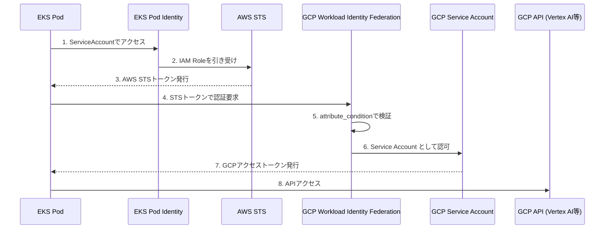

## はじめに

AWS EKS上のアプリケーションからGCPリソース（Vertex AI、BigQuery等）にアクセスする際、従来はGCPサービスアカウントキー（JSONファイル）を使用していました。しかし、この方法にはキーの漏洩リスクやローテーション管理の負担があります。

本記事では、**Workload Identity Federation** と **EKS Pod Identity** を組み合わせて、キーレスでGCPにアクセスする方法を解説します。

## 構成概要

### 認証フロー



### 使用する技術

| コンポーネント | 役割 |
|--------------|------|
| EKS Pod Identity | PodにAWS IAMロールを付与 |
| GCP Workload Identity Federation | 外部IdP（AWS）からのトークンを検証 |
| GCP Service Account | GCPリソースへのアクセス権限を管理 |

### IRSA vs EKS Pod Identity

AWS EKSでPodにIAMロールを付与する方法は2つあります。

| 項目 | IRSA | EKS Pod Identity |
|------|------|------------------|
| Trust Policy Principal | `oidc.eks.region.amazonaws.com/id/xxx` | `pods.eks.amazonaws.com` |
| ServiceAccountアノテーション | 必要 | 不要 |
| 設定の複雑さ | やや複雑 | シンプル |
| 推奨 | レガシー | **新規推奨** |

本記事では**EKS Pod Identity**を使用します。

## 設定手順

### 前提条件

- AWS EKSクラスターが構築済み
- EKS Pod Identity Agent アドオンがインストール済み
- GCPプロジェクトが作成済み
- Terraform / Terragrunt が使用可能

以下の値を適宜置き換えてください：

| 変数 | 説明 | 例 |
|------|------|-----|
| `<APP_NAME>` | アプリケーション名 | `sample-app` |
| `<GCP_PROJECT>` | GCPプロジェクトID | `my-gcp-project` |
| `<GCP_PROJECT_NUMBER>` | GCPプロジェクト番号 | `987654321098` |
| `<AWS_ACCOUNT_ID>` | AWSアカウントID | `123456789012` |
| `<EKS_CLUSTER_NAME>` | EKSクラスター名 | `my-eks-cluster` |
| `<NAMESPACE>` | K8s Namespace | `app` |
| `<ENV>` | 環境名 | `dev` |

---

### Step 1: GCPの設定

#### 1.1 サービスアカウント作成

```hcl:gcp_service_account.tf
resource "google_service_account" "app" {
  account_id   = "<APP_NAME>"
  display_name = "<APP_NAME>"
  description  = "<APP_NAME> for Vertex AI access"
  project      = "<GCP_PROJECT>"
}

# Vertex AIへのアクセス権限
resource "google_project_iam_member" "app_aiplatform" {
  project = "<GCP_PROJECT>"
  role    = "roles/aiplatform.user"
  member  = "serviceAccount:${google_service_account.app.email}"
}
```

#### 1.2 Workload Identity Pool / Provider 作成

```hcl:gcp_workload_identity.tf
resource "google_iam_workload_identity_pool" "aws_eks" {
  workload_identity_pool_id = "aws-eks-pool-<ENV>"
  display_name              = "AWS EKS Pool (<ENV>)"
  description               = "Workload Identity Pool for AWS EKS workloads"
  project                   = "<GCP_PROJECT>"
}

# Workload Identity Provider (AWS用)
resource "google_iam_workload_identity_pool_provider" "aws_eks" {
  workload_identity_pool_id          = google_iam_workload_identity_pool.aws_eks.workload_identity_pool_id
  workload_identity_pool_provider_id = "aws-eks-provider"
  display_name                       = "AWS EKS Provider"
  description                        = "AWS provider for EKS workloads (IRSA / Pod Identity)"
  project                            = "<GCP_PROJECT>"

  # AWS認証設定
  aws {
    account_id = "<AWS_ACCOUNT_ID>"
  }

  # 属性マッピング
  attribute_mapping = {
    "google.subject"     = "assertion.arn"
    "attribute.account"  = "assertion.account"
    "attribute.aws_role" = "assertion.arn"
  }

  # セキュリティ: 特定のIAMロールのみ許可
  attribute_condition = "assertion.arn.startsWith('arn:aws:sts::<AWS_ACCOUNT_ID>:assumed-role/<APP_NAME>-')"
}
```

:::message
**attribute_condition** は重要なセキュリティ設定です。これにより、許可されたIAMロール以外からのアクセスをブロックできます。
:::

#### 1.3 サービスアカウントへのバインディング

```hcl:gcp_wif_binding.tf
resource "google_service_account_iam_member" "workload_identity_user" {
  service_account_id = google_service_account.app.name
  role               = "roles/iam.workloadIdentityUser"
  member             = "principalSet://iam.googleapis.com/${google_iam_workload_identity_pool.aws_eks.name}/attribute.aws_role/arn:aws:sts::<AWS_ACCOUNT_ID>:assumed-role/<APP_NAME>-sa-role-<ENV>/<APP_NAME>-sa"
}
```

---

### Step 2: AWSの設定

#### 2.1 IAMロール作成（EKS Pod Identity用）

```hcl:aws_iam.tf
data "aws_iam_policy_document" "app_assume_role" {
  statement {
    effect = "Allow"
    principals {
      type        = "Service"
      identifiers = ["pods.eks.amazonaws.com"]
    }
    actions = [
      "sts:AssumeRole",
      "sts:TagSession"
    ]
  }
}

# IAMロール
resource "aws_iam_role" "app" {
  name               = "<APP_NAME>-sa-role-<ENV>"
  assume_role_policy = data.aws_iam_policy_document.app_assume_role.json

  # GCPアクセスのみの場合、AWSポリシーは不要
}

# EKS Pod Identity Association
resource "aws_eks_pod_identity_association" "app" {
  cluster_name    = "<EKS_CLUSTER_NAME>"
  namespace       = "<NAMESPACE>-<ENV>"
  service_account = "<APP_NAME>-sa"
  role_arn        = aws_iam_role.app.arn
}
```

:::message alert
**ロール名の一致に注意！**
GCP WIFの `aws_role_arn` と AWS IAMロール名が一致している必要があります。
不一致の場合、認証が失敗します。
:::

---

### Step 3: Kubernetesマニフェスト

#### 3.1 ServiceAccount

```yaml:sa.yaml
apiVersion: v1
kind: ServiceAccount
metadata:
  name: <APP_NAME>-sa
```

#### 3.2 GCP認証設定ConfigMap

GCP認証に必要なcredentials設定を作成します。

**gcloudコマンドで生成する場合:**

```bash
gcloud iam workload-identity-pools create-cred-config \
  projects/<GCP_PROJECT_NUMBER>/locations/global/workloadIdentityPools/aws-eks-pool-<ENV>/providers/aws-eks-provider \
  --service-account=<APP_NAME>@<GCP_PROJECT>.iam.gserviceaccount.com \
  --aws \
  --output-file=gcp-credentials.json
```

**EKS Pod Identity用ConfigMap（推奨）:**

EKS Pod Identityを使用する場合、`credential_source`は最小限の設定で動作します。GCPクライアントライブラリが環境変数 `AWS_CONTAINER_CREDENTIALS_FULL_URI` を自動検出します。

```yaml:gcp-wif-config.yaml
apiVersion: v1
kind: ConfigMap
metadata:
  name: <APP_NAME>-gcp-wif-config
data:
  gcp-credentials.json: |
    {
      "type": "external_account",
      "audience": "//iam.googleapis.com/projects/<GCP_PROJECT_NUMBER>/locations/global/workloadIdentityPools/aws-eks-pool-<ENV>/providers/aws-eks-provider",
      "subject_token_type": "urn:ietf:params:aws:token-type:aws4_request",
      "token_url": "https://sts.googleapis.com/v1/token",
      "credential_source": {
        "environment_id": "aws1",
        "regional_cred_verification_url": "https://sts.{region}.amazonaws.com?Action=GetCallerIdentity&Version=2011-06-15"
      },
      "service_account_impersonation_url": "https://iamcredentials.googleapis.com/v1/projects/-/serviceAccounts/<APP_NAME>@<GCP_PROJECT>.iam.gserviceaccount.com:generateAccessToken"
    }
```

**IRSA用ConfigMap:**

IRSAを使用する場合は、IMDSエンドポイントを明示的に指定します。

```yaml:gcp-wif-config.yaml
apiVersion: v1
kind: ConfigMap
metadata:
  name: <APP_NAME>-gcp-wif-config
data:
  gcp-credentials.json: |
    {
      "type": "external_account",
      "audience": "//iam.googleapis.com/projects/<GCP_PROJECT_NUMBER>/locations/global/workloadIdentityPools/aws-eks-pool-<ENV>/providers/aws-eks-provider",
      "subject_token_type": "urn:ietf:params:aws:token-type:aws4_request",
      "token_url": "https://sts.googleapis.com/v1/token",
      "credential_source": {
        "environment_id": "aws1",
        "region_url": "http://169.254.169.254/latest/meta-data/placement/availability-zone",
        "url": "http://169.254.169.254/latest/meta-data/iam/security-credentials",
        "regional_cred_verification_url": "https://sts.{region}.amazonaws.com?Action=GetCallerIdentity&Version=2011-06-15"
      },
      "service_account_impersonation_url": "https://iamcredentials.googleapis.com/v1/projects/-/serviceAccounts/<APP_NAME>@<GCP_PROJECT>.iam.gserviceaccount.com:generateAccessToken"
    }
```

:::message
`{region}` はプレースホルダーとしてそのまま記述します。GCPクライアントライブラリが実行時に自動置換します。
:::

#### 3.3 Deployment

```yaml:deployment.yaml
apiVersion: apps/v1
kind: Deployment
metadata:
  name: <APP_NAME>
spec:
  template:
    spec:
      serviceAccountName: <APP_NAME>-sa
      volumes:
      - name: gcp-wif-credentials
        configMap:
          name: <APP_NAME>-gcp-wif-config
      containers:
      - name: <APP_NAME>
        env:
        - name: GOOGLE_APPLICATION_CREDENTIALS
          value: /var/secrets/google/gcp-credentials.json
        - name: GOOGLE_CLOUD_PROJECT
          value: <GCP_PROJECT>
        volumeMounts:
        - name: gcp-wif-credentials
          mountPath: /var/secrets/google
          readOnly: true
```

---

## ローカル開発環境での認証

EKS上ではWorkload Identity Federationを使用しますが、ローカル開発環境ではGCPユーザー認証（ADC: Application Default Credentials）を使用します。

### ローカル環境のセットアップ

```bash
# GCPにログイン
gcloud auth login

# Application Default Credentialsを設定
gcloud auth application-default login

# プロジェクトを設定
gcloud config set project <GCP_PROJECT>
```

これにより、`~/.config/gcloud/application_default_credentials.json` が作成されます。

---

## TypeScriptアプリでの認証制御

GCPクライアントライブラリはADC（Application Default Credentials）を自動検出するため、環境ごとに異なる認証方法を透過的に扱えます。

### 認証の自動検出フロー

```
1. 環境変数 GOOGLE_APPLICATION_CREDENTIALS が設定されている場合
   → そのファイルパスの認証情報を使用（EKS: WIF credentials）

2. gcloud auth application-default login で設定された認証情報がある場合
   → ~/.config/gcloud/application_default_credentials.json を使用（ローカル）

3. GCPメタデータサーバーが利用可能な場合
   → インスタンスのサービスアカウントを使用（GCE/Cloud Run等）
```

### 実装例

#### パッケージのインストール

```bash
npm install @google-cloud/aiplatform
# または
npm install @google-cloud/vertexai
```

#### 基本的な実装

```typescript:src/gcp-client.ts
import { VertexAI } from '@google-cloud/vertexai';

// プロジェクトIDは環境変数から取得
const projectId = process.env.GOOGLE_CLOUD_PROJECT;
if (!projectId) {
  throw new Error('GOOGLE_CLOUD_PROJECT is required');
}

// クライアント初期化時に認証は自動で行われる
// - ローカル: ADCを使用
// - EKS: GOOGLE_APPLICATION_CREDENTIALS経由でWIFを使用
const vertexAI = new VertexAI({
  project: projectId,
  location: '<LOCATION>',
});

export async function generateContent(prompt: string): Promise<string> {
  const model = vertexAI.getGenerativeModel({
    model: '<MODEL_ID>',
  });

  const result = await model.generateContent(prompt);
  return result.response.candidates?.[0]?.content?.parts?.[0]?.text ?? '';
}
```

#### 認証状態の確認（デバッグ用）

```typescript:src/check-auth.ts
import { GoogleAuth } from 'google-auth-library';

export async function checkGCPAuth(): Promise<void> {
  const auth = new GoogleAuth({
    scopes: ['https://www.googleapis.com/auth/cloud-platform'],
  });

  try {
    const client = await auth.getClient();
    const projectId = await auth.getProjectId();

    console.log('GCP Authentication successful');
    console.log(`Project ID: ${projectId}`);
    console.log(`Client type: ${client.constructor.name}`);
  } catch (error) {
    console.error('GCP Authentication failed:', error);
    throw error;
  }
}
```

### 環境変数の設定

| 環境 | GOOGLE_APPLICATION_CREDENTIALS | GOOGLE_CLOUD_PROJECT |
|------|-------------------------------|---------------------|
| ローカル | 未設定（ADCを使用） | 任意（gcloud configから自動取得も可） |
| EKS | `/var/secrets/google/gcp-credentials.json` | `<GCP_PROJECT>` |

#### ローカル環境（.env.local）

```bash:.env.local
# GOOGLE_APPLICATION_CREDENTIALS は設定しない（ADCを使用）
GOOGLE_CLOUD_PROJECT=<GCP_PROJECT>
```

#### EKS環境

Deployment で設定済み（Step 3.3参照）

### 認証方式の判別

デバッグ時に現在どの認証方式が使われているか確認したい場合：

```typescript:src/auth-info.ts
import { GoogleAuth } from 'google-auth-library';

export async function getAuthInfo(): Promise<{
  type: 'user' | 'service_account' | 'external_account' | 'unknown';
  email?: string;
}> {
  const auth = new GoogleAuth();
  const client = await auth.getClient();

  // クライアントタイプで判別
  const clientType = client.constructor.name;

  if (clientType === 'ExternalAccountClient') {
    return { type: 'external_account' };
  }

  if (clientType === 'UserRefreshClient') {
    return { type: 'user' };
  }

  // サービスアカウントの場合
  if ('email' in client && typeof client.email === 'string') {
    return {
      type: 'service_account',
      email: client.email,
    };
  }

  return { type: 'unknown' };
}
```

---

## 設定の整合性確認

設定完了後、各コンポーネントの整合性を確認します。

### チェックリスト

| 項目 | AWS | GCP | K8s |
|------|-----|-----|-----|
| ロール名 | `<APP_NAME>-sa-role-<ENV>` | WIF binding | - |
| ServiceAccount | Pod Identity | WIF binding末尾 | sa.yaml |
| Pool ID | - | `aws-eks-pool-<ENV>` | audience |
| SA Email | - | service_account_bindings | impersonation_url |

### 確認コマンド

```bash
# AWS: IAMロール確認
aws iam get-role --role-name <APP_NAME>-sa-role-<ENV>

# AWS: Pod Identity Association確認
aws eks list-pod-identity-associations --cluster-name <EKS_CLUSTER_NAME>

# GCP: WIF設定確認
gcloud iam workload-identity-pools providers describe aws-eks-provider \
  --workload-identity-pool=aws-eks-pool-<ENV> \
  --location=global \
  --project=<GCP_PROJECT>

# GCP: SA IAMバインディング確認
gcloud iam service-accounts get-iam-policy \
  <APP_NAME>@<GCP_PROJECT>.iam.gserviceaccount.com \
  --project=<GCP_PROJECT>
```

---

## 動作確認

Pod内で以下を実行して認証が動作しているか確認します。

```bash
# AWS認証確認
aws sts get-caller-identity

# GCP認証確認（TypeScriptの場合）
npx ts-node -e "import { GoogleAuth } from 'google-auth-library'; new GoogleAuth().getProjectId().then(p => console.log('Project:', p))"
```

---

## セキュリティ考慮事項

### ConfigMap vs Secret

`gcp-credentials.json` にはシークレットが含まれていないため、ConfigMapで問題ありません。

| ConfigMapの内容 | 機密性 |
|----------------|-------|
| audience (Pool URI) | 公開情報 |
| token_url | 公開情報 |
| credential_source | 公開情報 |
| service_account_impersonation_url | 公開情報 |

認証を成功させるには、**AWS IAMロール**へのアクセスが必要であり、これはEKS Pod Identityで保護されています。

### 多層防御

```
1. EKS Pod Identity: 特定のServiceAccountのみがIAMロールを引き受け可能
2. AWS IAM Role: Trust Policyでpods.eks.amazonaws.comに制限
3. GCP WIF attribute_condition: 特定のIAMロールARNのみ許可
4. GCP IAM: サービスアカウントに最小権限を付与
```

---

## トラブルシューティング

### ロール名の不一致

**症状**: GCP WIFで認証失敗

**確認方法**:
```bash
# AWS側の実際のロール名
aws iam list-roles --query "Roles[?contains(RoleName, '<APP_NAME>')].[RoleName]"

# GCP WIF設定
gcloud iam workload-identity-pools providers describe aws-eks-provider \
  --workload-identity-pool=aws-eks-pool-<ENV> \
  --location=global
```

### Pool IDの不一致

**症状**: "Invalid audience" エラー

**確認方法**:
```bash
# GCP側のPool ID確認
gcloud iam workload-identity-pools list --location=global --project=<GCP_PROJECT>

# K8s ConfigMap確認
kubectl get configmap <APP_NAME>-gcp-wif-config -o yaml | grep audience
```

---

## まとめ

Workload Identity Federation + EKS Pod Identity を使うことで：

- **キーレス認証**: サービスアカウントキーの管理が不要
- **セキュリティ向上**: キー漏洩リスクの排除
- **運用負担軽減**: キーローテーションが不要
- **開発体験の統一**: ローカルではADC、EKSではWIFを透過的に切り替え

設定は複数のコンポーネントにまたがるため、**整合性の確認**が重要です。特にロール名やPool IDの一致に注意してください。

## 参考リンク

- [GCP Workload Identity Federation](https://cloud.google.com/iam/docs/workload-identity-federation)
- [GCP Workload Identity Federation with AWS](https://cloud.google.com/iam/docs/workload-identity-federation-with-other-clouds)
- [EKS Pod Identity](https://docs.aws.amazon.com/eks/latest/userguide/pod-identities.html)
