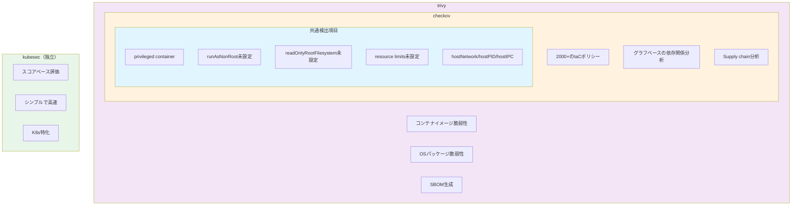
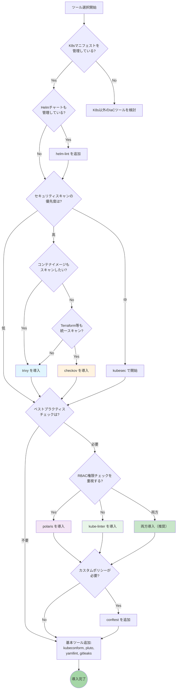
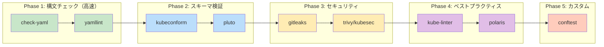
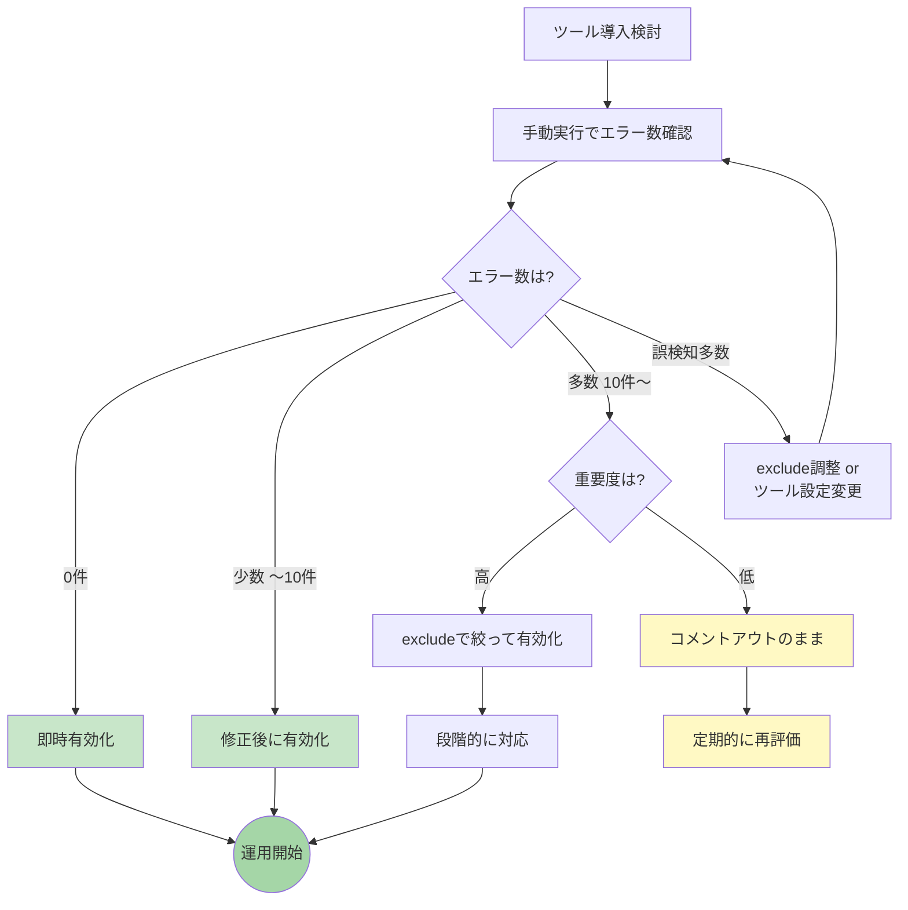

## はじめに

Kubernetesマニフェストを複数リポジトリで管理していると、以下のような問題に直面することがあります。

- マニフェストの構文エラーがデプロイ時まで気づかない
- 非推奨APIの使用に気づかずアップグレードで障害発生
- セキュリティベストプラクティスが守られているか不安
- チームメンバーによってチェック品質にばらつきがある

そこで、K8sマニフェストリポジトリにpre-commit設定を導入しました。本記事では、導入を検討したツールとその特徴を紹介します。

**注意:** 本記事の設定例では [mise](https://mise.jdx.dev/) を使用してツールを管理しています。miseを使用していない場合は、`mise exec --` の部分を削除し、各ツールを直接実行してください。

## ツール一覧

本記事で紹介するpre-commit hooksは以下の通りです。

### 基本チェック（pre-commit-hooks）

| hook | 用途 |
|------|------|
| check-added-large-files | 大きなファイルの追加検知 |
| check-json | JSON構文チェック |
| check-merge-conflict | マージコンフリクトマーカー検知 |
| check-yaml | YAML構文チェック |
| detect-private-key | 秘密鍵の混入検知 |
| end-of-file-fixer | ファイル末尾の改行修正 |
| no-commit-to-branch | 保護ブランチへの直接コミット禁止 |
| trailing-whitespace | 行末空白の削除 |

### GitHub Actions関連

| hook | 用途 | 開発元 |
|------|------|--------|
| actionlint | GitHub Actions構文チェック | rhysd |
| pinact | GitHub Actions SHA固定チェック | suzuki-shunsuke |
| zizmor | GitHub Actionsセキュリティ監査 | woodruffw |

### Kubernetesマニフェスト検証

| hook | 用途 | 開発元 |
|------|------|--------|
| kubeconform | K8sマニフェストスキーマ検証 | yannh |
| pluto | 非推奨K8s API検出 | Fairwinds |
| kube-linter | K8sベストプラクティスチェック | Stackrox |
| polaris | K8sベストプラクティス検証 | Fairwinds |
| kustomize-build | Kustomizeビルド検証 | - |
| conftest | カスタムポリシーチェック | Open Policy Agent |

### Helm関連

| hook | 用途 | 開発元 |
|------|------|--------|
| helm-lint | Helmチャート構文チェック | Helm |
| nova | Helmチャート更新チェック | Fairwinds |

### セキュリティスキャン

| hook | 用途 | 開発元 |
|------|------|--------|
| gitleaks | シークレット検出 | Gitleaks |
| trivy | セキュリティ脆弱性スキャン | Aqua Security |
| checkov | IaCセキュリティスキャン | Bridgecrew |
| kubesec | セキュリティスコアリング | controlplaneio |

### YAML/汎用

| hook | 用途 | 開発元 |
|------|------|--------|
| yamllint | YAMLリンティング | adrienverge |
| shellcheck | シェルスクリプト静的解析 | koalaman |

## 各ツールの詳細

### 1. kubeconform - スキーマ検証

Kubernetesマニフェストが正しいスキーマに従っているか検証します。

```yaml
- id: kubeconform
  name: kubeconform
  entry: mise exec -- kubeconform -strict -ignore-missing-schemas
  language: system
  files: \.(yaml|yml)$
  exclude: ^(\.github/|.*overlays/.+|kustomization\.yaml$)
```

**特徴：**
- Kubernetes公式スキーマに基づいた厳密な検証
- `-ignore-missing-schemas`でCRDをスキップ可能
- kubeval（非推奨）の後継ツール

**注意点：**
- Kustomizeのパッチファイルは部分的なマニフェストのため`Invalid`になる（正常動作）
- CRD（ArgoCD Application等）はスキーマがないため`Skipped`になる

### 2. pluto - 非推奨API検出

Kubernetesバージョンアップ時に削除されるAPIを事前に検出します。

```yaml
- id: pluto
  name: pluto (detect deprecated APIs)
  entry: mise exec -- pluto detect-files -d .
  language: system
  pass_filenames: false
  files: \.(yaml|yml)$
  exclude: ^(\.github/)
```

**特徴：**
- K8s 1.16以降で削除されたAPIを検出
- 将来削除予定のAPIも警告
- Helmチャートにも対応

**活用シーン：**
- クラスタアップグレード前のチェック
- CI/CDパイプラインでの自動検出

### 3. kube-linter - ベストプラクティスチェック

Stackrox社製のK8sマニフェストリンター。セキュリティとベストプラクティスをチェックします。

```yaml
- id: kube-linter
  name: kube-linter
  entry: mise exec -- kube-linter lint
  language: system
  files: \.(yaml|yml)$
  exclude: ^(\.github/|.*overlays/.+|kustomization\.yaml$)
```

**主なチェック項目：**

| チェック | 説明 |
|---------|------|
| `no-read-only-root-fs` | readOnlyRootFilesystemが未設定 |
| `run-as-non-root` | runAsNonRootが未設定 |
| `pdb-unhealthy-pod-eviction-policy` | PDBのunhealthyPodEvictionPolicyが未設定 |
| `unset-cpu-requirements` | CPUリソース制限が未設定 |
| `unset-memory-requirements` | メモリリソース制限が未設定 |
| `dangling-service` | Serviceが参照するDeploymentが存在しない |

**特徴：**
- 60以上のビルトインチェック
- カスタムチェックの追加が可能
- `.kube-linter.yaml`で設定をカスタマイズ

### 4. polaris - Fairwinds製ベストプラクティス検証

kube-linterと補完関係にあるFairwinds社製ツール。RBAC検証やLinux hardening設定のチェックが強みです。

```yaml
- id: polaris
  name: polaris
  entry: mise exec -- polaris audit --audit-path . --only-show-failed-tests --format=pretty --set-exit-code-on-danger
  language: system
  files: \.(yaml|yml)$
  exclude: ^(\.github/)
  pass_filenames: false
```

**主なチェック項目：**

| チェック | 説明 |
|---------|------|
| `linuxHardening` | AppArmor/Seccomp/SELinux設定 |
| `clusterrolePodExecAttach` | ClusterRoleのpods/exec権限 |
| `rolePodExecAttach` | Roleのpods/exec権限 |
| `sensitiveConfigmapContent` | ConfigMap内の機密情報 |
| `missingNetworkPolicy` | NetworkPolicy未設定 |
| `topologySpreadConstraint` | Pod分散制約 |

**特徴：**
- スコア形式での評価（0-100点）
- Webhookモードでクラスタ内検証も可能
- Fairwinds Insightsとの連携

### 5. trivy - セキュリティ脆弱性スキャン

Aqua Security社製の包括的セキュリティスキャナー。

```yaml
- id: trivy
  name: trivy config scan
  entry: mise exec -- trivy config --exit-code 1 --skip-dirs .github .
  language: system
  files: \.(yaml|yml)$
  exclude: ^(\.github/)
  pass_filenames: false
```

**主なチェック項目：**

| ID | 説明 |
|----|------|
| AVD-KSV-0014 | readOnlyRootFilesystemが未設定 |
| AVD-KSV-0056 | ClusterRoleに過剰な権限 |
| AVD-KSV-0118 | デフォルトsecurityContext使用 |

**特徴：**
- IaCだけでなくコンテナイメージスキャンも可能
- HIGH/CRITICALのみフィルタリング可能
- 豊富な出力フォーマット（JSON, SARIF等）

### 6. kustomize-build - ビルド検証

Kustomizeでマニフェストが正しくビルドできるか検証します。

```yaml
- id: kustomize-build
  name: kustomize build check
  entry: bash -c 'for dir in $(find . -name kustomization.yaml -not -path "./.github/*" -exec dirname {} \; | sort -u); do kustomize build "$dir" > /dev/null || exit 1; done'
  language: system
  files: \.(yaml|yml)$
  exclude: ^(\.github/)
  pass_filenames: false
```

**検出できる問題：**
- overlaysがbasesに存在しないリソースをパッチしようとしている
- kustomization.yamlで参照しているファイルが存在しない
- 同名のConfigMapが重複している（Namespace ID競合）

**注意点：**
実運用で問題になっていないケースもあるため、失敗する場合はコメントで原因を記載してコメントアウトしておくのも一つの方法です。

### 7. zizmor - GitHub Actionsセキュリティ監査

GitHub Actionsワークフローのセキュリティ問題を検出します。

```yaml
- id: zizmor
  name: zizmor
  entry: mise exec -- zizmor
  language: system
  files: ^\.github/(workflows|actions)/.*\.(yml|yaml)$
```

**主な検出項目：**

| 深刻度 | 問題 | 説明 |
|--------|------|------|
| High | `unpinned-uses` | アクションがSHA固定されていない |
| High | `secrets-inherit` | シークレットを無条件に継承 |
| Medium | `excessive-permissions` | 権限が広すぎる（`permissions:`未設定） |
| Medium | `dangerous-triggers` | `pull_request_target`の使用 |

### 8. pinact - GitHub Actions SHA固定

GitHub Actionsのアクションバージョンをコミットハッシュに固定します。

```yaml
- id: pinact
  name: pinact
  entry: mise exec -- pinact run
  language: system
  files: ^\.github/.*\.(yml|yaml)$
```

**注意点：**
Reusable Workflowsを`@main`で参照している場合、SHA固定が難しいケースがあります。その場合は以下の対応を検討：
- Reusable Workflowsをバージョンタグで管理
- pinactの設定で特定リポジトリを除外

### 9. gitleaks - シークレット検出

ハードコードされた認証情報を検出します。

```yaml
- id: gitleaks
  name: Detect hardcoded secrets
  entry: mise exec -- gitleaks protect --verbose --redact --staged
  language: system
  pass_filenames: false
```

K8sマニフェストでは特にSealedSecretではない生のSecret定義や、ConfigMapに埋め込まれた認証情報を検出できます。

### 10. conftest - カスタムポリシーチェック

Open Policy Agent (OPA) のRegoポリシーを使って、組織独自のルールを適用できます。

```yaml
- id: conftest
  name: conftest
  entry: mise exec -- conftest test
  language: system
  files: \.(yaml|yml)$
  exclude: ^(\.github/)
```

**特徴：**
- Regoでカスタムポリシーを記述
- 組織固有のルールを強制できる
- Kubernetes以外のIaCにも対応

**ポリシー例（policy/k8s.rego）：**
```rego
package main

deny contains msg if {
  input.kind == "Deployment"
  some container in input.spec.template.spec.containers
  not container.resources.limits
  msg := "Deployment must have resource limits"
}

deny contains msg if {
  input.kind == "Service"
  input.spec.type == "LoadBalancer"
  msg := "LoadBalancer type is not allowed"
}
```

**活用シーン：**
- 「本番環境ではLoadBalancerは使わない」などの組織ルール
- kube-linter/polarisにないカスタムチェック

### 11. yamllint - YAMLリンティング

YAML構文のベストプラクティスをチェックします。

```yaml
- id: yamllint
  name: yamllint
  entry: mise exec -- yamllint
  language: system
  files: \.(yaml|yml)$
```

**主なチェック項目：**

| ルール | 説明 |
|--------|------|
| `line-length` | 行の最大文字数 |
| `indentation` | インデントの一貫性 |
| `trailing-spaces` | 行末空白 |
| `truthy` | `yes/no`を`true/false`に統一 |
| `key-duplicates` | 重複キーの検出 |

**設定例（.yamllint.yaml）：**
```yaml
extends: default
rules:
  line-length:
    max: 200
  truthy:
    check-keys: false
```

### 12. helm-lint - Helmチャート検証

Helmチャートの構文とベストプラクティスをチェックします。

```yaml
- id: helm-lint
  name: helm lint
  entry: bash -c 'for chart in $(find . -name Chart.yaml -exec dirname {} \;); do helm lint "$chart" || exit 1; done'
  language: system
  files: \.(yaml|yml)$
  pass_filenames: false
```

**検出できる問題：**
- テンプレート構文エラー
- 必須フィールドの欠落
- values.yamlとの不整合
- 非推奨機能の使用

### 13. nova - Helmチャート更新チェック

Fairwinds社製のHelmリリース更新チェッカー。使用中のチャートに新バージョンがあるか確認します。

```yaml
- id: nova
  name: nova
  entry: mise exec -- nova find
  language: system
  pass_filenames: false
```

**特徴：**
- Helmリリースの古いバージョンを検出
- セキュリティパッチの適用漏れを防止
- クラスタ内スキャンとファイルスキャン両対応

### 14. checkov - IaCセキュリティスキャン

Bridgecrew社製の包括的IaCセキュリティスキャナー。

```yaml
- id: checkov
  name: checkov
  entry: mise exec -- checkov -d .
  language: system
  files: \.(yaml|yml)$
  exclude: ^(\.github/)
  pass_filenames: false
```

**特徴：**
- 2000以上のビルトインポリシー
- Kubernetes, Terraform, CloudFormation等に対応
- CIS Benchmarkベースのチェック
- カスタムポリシー対応（Python/YAML）

**trivyとの比較：**

| 観点 | checkov | trivy |
|------|---------|-------|
| ポリシー数 | 2000+ | 300+ |
| カスタムポリシー | Python/YAML | Rego |
| コンテナスキャン | なし | あり |
| 実行速度 | やや遅い | 速い |
| 出力形式 | 豊富 | 豊富 |

### 15. kubesec - セキュリティスコアリング

controlplane社製のK8sリソースセキュリティスコアリングツール。

```yaml
- id: kubesec
  name: kubesec
  entry: bash -c 'for f in "$@"; do mise exec -- kubesec scan "$f" || exit 1; done' --
  language: system
  files: \.(yaml|yml)$
  exclude: ^(\.github/|.*overlays/.+|kustomization\.yaml$)
```

**特徴：**
- シンプルなスコア形式（-100〜+10）
- 危険な設定には即座に負のスコア
- CI/CDに組み込みやすい

**スコア例：**
- `+1`: runAsNonRoot設定
- `+1`: readOnlyRootFilesystem設定
- `-30`: hostNetwork使用
- `-30`: privileged: true

### 16. shellcheck - シェルスクリプト静的解析

シェルスクリプトの問題を検出します。K8sマニフェスト内のスクリプトやCIスクリプトに有用です。

```yaml
- id: shellcheck
  name: shellcheck
  entry: mise exec -- shellcheck
  language: system
  files: \.(sh|bash)$
```

**検出できる問題：**
- 未定義変数の参照
- クォートの漏れ
- Bashism（POSIX非互換）
- 危険なコマンドパターン

**活用シーン：**
- ConfigMapに埋め込むスクリプト
- initContainerのコマンド
- CI/CDスクリプト

## ツール比較

本記事で紹介したツールには機能が重複するものが多くあります。ここでは用途別に詳細な比較を行います。

### セキュリティスキャナー比較：trivy vs checkov vs kubesec

3つのツールはいずれもK8sマニフェストのセキュリティ問題を検出しますが、アプローチと得意分野が異なります。

#### 基本情報

| 項目 | trivy | checkov | kubesec |
|------|-------|---------|---------|
| 開発元 | Aqua Security | Bridgecrew (Palo Alto) | controlplane |
| ライセンス | Apache 2.0 | Apache 2.0 | Apache 2.0 |
| 言語 | Go | Python | Go |
| ポリシー数 | 300+ | 2000+ | 30+ |
| 実行速度 | ◎ 高速 | △ やや遅い | ◎ 高速 |

#### 機能比較

| 機能 | trivy | checkov | kubesec |
|------|:-----:|:-------:|:-------:|
| K8sマニフェスト検証 | ✅ | ✅ | ✅ |
| Terraformスキャン | ✅ | ✅ | ❌ |
| CloudFormationスキャン | ✅ | ✅ | ❌ |
| Dockerfileスキャン | ✅ | ✅ | ❌ |
| コンテナイメージスキャン | ✅ | ❌ | ❌ |
| SBOM生成 | ✅ | ❌ | ❌ |
| カスタムポリシー | ✅ (Rego) | ✅ (Python/YAML) | ❌ |
| CIS Benchmark | ✅ | ✅ | ❌ |
| スコアリング | ❌ | ❌ | ✅ |
| IDEプラグイン | ✅ | ✅ | ❌ |

#### 検出項目の重複と差異



**図の見方：**
- 内側ほど多くのツールで共通して検出される項目
- trivy/checkovは重複が多いため、両方導入時は使い分けが重要

#### 選択ガイド

| ユースケース | 推奨ツール | 理由 |
|-------------|-----------|------|
| K8s + コンテナイメージを統一スキャン | **trivy** | 唯一イメージスキャン対応 |
| Terraform/K8s/CloudFormation混在環境 | **checkov** | マルチIaC対応が最も充実 |
| 素早くセキュリティ状況を把握したい | **kubesec** | スコアで直感的に理解可能 |
| pre-commitで軽量に実行したい | **trivy** or **kubesec** | 高速 |
| 詳細なレポートが必要（CI向け） | **checkov** | レポート機能が充実 |
| 両方の強みを活かしたい | **trivy (pre-commit) + checkov (CI)** | 使い分け |

**著者推奨:** pre-commitには**trivy**（高速・コンテナスキャン対応）、CIには**checkov**（詳細レポート）という使い分けがバランス良い。

### ベストプラクティスツール比較：kube-linter vs polaris

両ツールは補完関係にあるため、両方導入することを推奨します。

#### 基本情報

| 項目 | kube-linter | polaris |
|------|-------------|---------|
| 開発元 | Stackrox (Red Hat) | Fairwinds |
| ライセンス | Apache 2.0 | Apache 2.0 |
| チェック数 | 60+ | 30+ |
| デフォルト設定 | 緩め | 厳格 |
| 出力形式 | シンプル | スコア付き |

#### 機能比較

| 機能 | kube-linter | polaris |
|------|:-----------:|:-------:|
| securityContext検証 | ✅ | ✅ |
| リソース制限検証 | ✅ | ✅ |
| Probe設定検証 | ✅ | ✅ |
| RBAC詳細検証 | △ 基本のみ | ✅ |
| Linux hardening | ❌ | ✅ |
| Danglingリソース検出 | ✅ | ❌ |
| NetworkPolicy検証 | ✅ | ✅ |
| Webhookモード | ❌ | ✅ |
| カスタムチェック | ✅ | ✅ |
| CIS Benchmark | ✅ | ❌ |

#### 独自機能の詳細

**kube-linter独自の機能：**
| チェック | 説明 |
|---------|------|
| `dangling-service` | Serviceが参照するDeploymentが存在しない |
| `dangling-ingress` | Ingressが参照するServiceが存在しない |
| `dangling-networkpolicy` | NetworkPolicyが参照するPodが存在しない |
| `dangling-horizontalpodautoscaler` | HPAが参照するリソースが存在しない |
| `host-ipc` / `host-pid` | ホストのIPC/PID Namespaceの使用検出 |
| `writable-host-mount` | 書き込み可能なホストマウント |

**Polaris独自の機能：**
| チェック | 説明 |
|---------|------|
| `linuxHardening` | AppArmor/Seccomp/SELinux設定 |
| `clusterrolePodExecAttach` | ClusterRoleのpods/exec権限 |
| `rolePodExecAttach` | Roleのpods/exec権限 |
| `rolebindingClusterAdmin` | cluster-admin権限の付与 |
| `sensitiveConfigmapContent` | ConfigMap内の機密情報検出 |
| `topologySpreadConstraint` | Pod分散制約 |
| `pdbDisruptionsAllowed` | PDBのminAvailable/maxUnavailable整合性 |

#### 選択ガイド

| ユースケース | 推奨 |
|-------------|------|
| RBAC権限のセキュリティを重視 | **polaris** |
| 未参照リソースを検出したい | **kube-linter** |
| 最小限のチェックから始めたい | **kube-linter**（設定で絞れる） |
| スコアで進捗を可視化したい | **polaris** |
| 両方の強みを活かしたい | **両方導入**（推奨） |

### スキーマ・構文検証比較：kubeconform vs yamllint vs check-yaml

| 項目 | kubeconform | yamllint | check-yaml |
|------|-------------|----------|------------|
| 目的 | K8sスキーマ検証 | YAMLスタイル検証 | YAML構文検証 |
| 検証レベル | 深い（K8s固有） | 中（スタイル） | 浅い（構文のみ） |
| CRD対応 | スキップ可能 | N/A | N/A |
| カスタマイズ | オプションのみ | `.yamllint.yaml` | argsのみ |
| 実行速度 | ◎ | ◎ | ◎ |

**使い分け：**
- **check-yaml**: 最低限の構文チェック（必須）
- **yamllint**: コードスタイルの統一（推奨）
- **kubeconform**: K8sマニフェストとしての正当性検証（K8sリポジトリでは必須）

### GitHub Actionsツール比較：actionlint vs zizmor vs pinact

| 項目 | actionlint | zizmor | pinact |
|------|------------|--------|--------|
| 目的 | 構文チェック | セキュリティ監査 | バージョン固定 |
| 検出対象 | 構文エラー、typo | 権限過剰、危険なトリガー | 未固定アクション |
| 自動修正 | ❌ | ❌ | ✅ |
| 重要度 | 高 | 高 | 中 |

**推奨導入順序：**
1. **actionlint**: 構文エラーは確実に防ぎたい
2. **zizmor**: セキュリティ問題の早期発見
3. **pinact**: サプライチェーンセキュリティ強化

### ポリシーエンジン比較：conftest vs kube-linter vs polaris

カスタムポリシーを書きたい場合の比較です。

| 項目 | conftest | kube-linter | polaris |
|------|----------|-------------|---------|
| ポリシー言語 | Rego | YAML | YAML/JSON |
| 学習コスト | 高 | 低 | 低 |
| 柔軟性 | ◎ | ○ | ○ |
| ビルトインポリシー | なし | あり | あり |
| K8s以外への適用 | ✅ | ❌ | ❌ |

**選択ガイド：**
- **kube-linter/polaris のカスタム機能で十分な場合**: conftestは不要
- **複雑な条件分岐が必要な場合**: conftest（Regoの柔軟性）
- **Terraform等にも同じルールを適用したい**: conftest

### シークレット検出比較：gitleaks vs trivy vs detect-private-key

| 項目 | gitleaks | trivy (secret) | detect-private-key |
|------|----------|----------------|-------------------|
| 検出パターン | 700+ | 100+ | 秘密鍵のみ |
| 設定カスタマイズ | ✅ | ✅ | ❌ |
| Git履歴スキャン | ✅ | ❌ | ❌ |
| 実行速度 | ○ | ◎ | ◎ |

**推奨：**
- **最低限**: detect-private-key（設定不要）
- **推奨**: gitleaks（網羅的な検出）
- **すでにtrivy導入済み**: trivy secret機能を活用

### ツール選択フロー

どのツールを導入すべきか迷った場合は、以下のフローを参考にしてください。



### 検証パイプラインの推奨順序

pre-commitでのチェック順序は、軽量なものから重いものへ並べることで効率的に実行できます。



**ポイント：**
- 早い段階で失敗すると後続のチェックはスキップされる
- 構文エラーは最初に検出することで無駄な実行を防ぐ
- 重いツール（polaris, checkov等）は後半に配置

### 総合比較マトリクス

各ツールがカバーする領域を一覧で示します。

| カテゴリ | ツール | 構文 | スキーマ | ベストプラクティス | セキュリティ | カスタム |
|---------|--------|:----:|:-------:|:-----------------:|:-----------:|:-------:|
| 基本 | check-yaml | ✅ | - | - | - | - |
| 基本 | yamllint | ✅ | - | - | - | ✅ |
| K8s | kubeconform | - | ✅ | - | - | - |
| K8s | pluto | - | - | ✅ | - | - |
| K8s | kube-linter | - | - | ✅ | ✅ | ✅ |
| K8s | polaris | - | - | ✅ | ✅ | ✅ |
| セキュリティ | trivy | - | - | - | ✅ | ✅ |
| セキュリティ | checkov | - | - | ✅ | ✅ | ✅ |
| セキュリティ | kubesec | - | - | - | ✅ | - |
| セキュリティ | gitleaks | - | - | - | ✅ | ✅ |
| ポリシー | conftest | - | - | - | - | ✅ |

## 設定ファイル例

```yaml:.pre-commit-config.yaml
---
repos:
  - repo: https://github.com/pre-commit/pre-commit-hooks
    rev: v5.0.0
    hooks:
      - id: check-added-large-files
      - id: check-json
      - id: check-merge-conflict
      - id: check-yaml
        args: ['--allow-multiple-documents']
      - id: detect-private-key
      - id: end-of-file-fixer
      - id: no-commit-to-branch
        args: ['--branch', 'main']
      - id: trailing-whitespace
        args: [--markdown-linebreak-ext=md]

  - repo: local
    hooks:
      # === GitHub Actions ===
      - id: actionlint
        name: actionlint
        entry: mise exec -- actionlint
        language: system
        files: ^\.github/workflows/.*\.(yml|yaml)$

      # === シークレット検出 ===
      - id: gitleaks
        name: Detect hardcoded secrets
        entry: mise exec -- gitleaks protect --verbose --redact --staged
        language: system
        pass_filenames: false

      # === YAML検証 ===
      - id: yamllint
        name: yamllint
        entry: mise exec -- yamllint
        language: system
        files: \.(yaml|yml)$

      # === K8sスキーマ検証 ===
      - id: kubeconform
        name: kubeconform
        entry: mise exec -- kubeconform -strict -ignore-missing-schemas
        language: system
        files: \.(yaml|yml)$
        exclude: ^(\.github/|.*overlays/.+|kustomization\.yaml$)

      # === 非推奨API検出 ===
      - id: pluto
        name: pluto (detect deprecated APIs)
        entry: mise exec -- pluto detect-files -d .
        language: system
        pass_filenames: false
        files: \.(yaml|yml)$
        exclude: ^(\.github/)

      # === ベストプラクティス ===
      - id: kube-linter
        name: kube-linter
        entry: mise exec -- kube-linter lint
        language: system
        files: \.(yaml|yml)$
        exclude: ^(\.github/|.*overlays/.+|kustomization\.yaml$)

      - id: polaris
        name: polaris
        entry: mise exec -- polaris audit --audit-path . --only-show-failed-tests --format=pretty --set-exit-code-on-danger
        language: system
        files: \.(yaml|yml)$
        exclude: ^(\.github/)
        pass_filenames: false

      # === セキュリティスキャン ===
      - id: trivy
        name: trivy config scan
        entry: mise exec -- trivy config --exit-code 1 --severity HIGH,CRITICAL --skip-dirs .github .
        language: system
        files: \.(yaml|yml)$
        exclude: ^(\.github/)
        pass_filenames: false

      - id: checkov
        name: checkov
        entry: mise exec -- checkov -d . --quiet
        language: system
        files: \.(yaml|yml)$
        exclude: ^(\.github/)
        pass_filenames: false

      - id: kubesec
        name: kubesec
        entry: bash -c 'for f in "$@"; do mise exec -- kubesec scan "$f" || exit 1; done' --
        language: system
        files: \.(yaml|yml)$
        exclude: ^(\.github/|.*overlays/.+|kustomization\.yaml$)

      # === カスタムポリシー ===
      - id: conftest
        name: conftest
        entry: mise exec -- conftest test
        language: system
        files: \.(yaml|yml)$
        exclude: ^(\.github/)

      # === Helm ===
      - id: helm-lint
        name: helm lint
        entry: bash -c 'for chart in $(find . -name Chart.yaml -exec dirname {} \;); do helm lint "$chart" || exit 1; done'
        language: system
        files: \.(yaml|yml)$
        pass_filenames: false

      - id: nova
        name: nova
        entry: mise exec -- nova find
        language: system
        pass_filenames: false

      # === シェルスクリプト ===
      - id: shellcheck
        name: shellcheck
        entry: mise exec -- shellcheck
        language: system
        files: \.(sh|bash)$
```

## 段階的な導入のすすめ

いきなり全ツールを有効化すると、大量のエラーに圧倒されて導入が頓挫しがちです。以下のステップで段階的に導入することを推奨します。

### ツール選択ガイド

本記事で紹介した多くのツールには重複する機能があります。以下のガイドを参考に、環境に合ったツールを選択してください。

#### セキュリティスキャン：trivy vs checkov vs kubesec

| 要件 | 推奨ツール |
|------|-----------|
| K8sマニフェスト＋コンテナイメージも検証したい | **trivy** |
| IaC全般（Terraform, CloudFormation含む）を統一ツールで検証 | **checkov** |
| シンプルなスコアで素早く判断したい | **kubesec** |
| 最小限の導入で開始したい | **trivy**（速度・機能のバランス◎） |

**両方導入する場合の注意：**
trivyとcheckovは検出項目が重複するため、片方をCI、片方をpre-commitにするなど使い分けを検討。

#### ベストプラクティス：kube-linter vs polaris

両方導入を推奨しますが、1つだけ選ぶ場合：

| 要件 | 推奨ツール |
|------|-----------|
| RBAC権限の詳細チェックが必要 | **polaris** |
| Danglingリソース（未参照Service等）を検出したい | **kube-linter** |
| 段階的に有効化したい（設定が柔軟） | **kube-linter** |
| スコアで可視化したい | **polaris** |

#### カスタムポリシー：conftest

以下の場合にconftestの導入を検討：
- 組織固有のルールを強制したい（例：「特定ラベル必須」）
- kube-linter/polarisにないチェックが必要
- OPA/Regoの知識がある

#### Helm関連：helm-lint / nova

| 要件 | 推奨ツール |
|------|-----------|
| Helmチャートを管理している | **helm-lint**（必須） |
| チャートのバージョン管理をしたい | **nova**（補助的） |
| Helmを使用していない | 導入不要 |

### Step 1: 現状把握（コメントアウト状態で追加）

まず全ツールをコメントアウト状態で`.pre-commit-config.yaml`に追加し、手動で実行して現状を把握します。

```bash
# 各ツールを手動で実行して現状把握
mise exec -- yamllint .
mise exec -- kubeconform -strict -ignore-missing-schemas .
mise exec -- pluto detect-files -d .
mise exec -- kube-linter lint .
mise exec -- polaris audit --audit-path . --format=pretty
mise exec -- trivy config .
mise exec -- kubesec scan deployment.yaml  # 個別ファイル指定
```

**確認ポイント：**
- 各ツールでどの程度のエラー/警告が出るか
- すぐに修正できるものと時間がかかるものの分類
- 誤検知の有無

### Step 2: 低リスクツールの有効化

開発フローへの影響が少なく、誤検知がほぼないツールから有効化します。

| ツール | リスク | 理由 |
|--------|--------|------|
| check-yaml | 低 | 構文エラーのみ検出、修正が容易 |
| check-json | 低 | 同上 |
| check-merge-conflict | 低 | マーカーの検出のみ |
| end-of-file-fixer | 低 | 自動修正される |
| trailing-whitespace | 低 | 自動修正される |
| detect-private-key | 低 | 明確な問題のみ検出 |
| actionlint | 低 | GitHub Actions構文のみ |
| yamllint | 低 | YAML構文・スタイルのみ（設定で緩和可能） |
| shellcheck | 低 | シェルスクリプト限定、誤検知少ない |

```bash
# 有効化後、全ファイルでテスト
mise exec -- pre-commit run --all-files
```

**yamllint導入時のヒント：**
デフォルト設定は厳しめなので、`.yamllint.yaml`で緩和することを推奨。
```yaml
extends: default
rules:
  line-length:
    max: 200
  truthy:
    check-keys: false
```

### Step 3: スキーマ・API検証ツールの有効化

K8sマニフェスト固有のチェックを追加します。

| ツール | 導入時の注意点 |
|--------|---------------|
| kubeconform | CRDはスキップされる。パッチファイルはInvalidになるため`exclude`パターンを調整 |
| pluto | エラーが出なければ安全に有効化可能。アップグレード計画に活用 |

**kubeconform導入時のexclude例：**
```yaml
exclude: ^(\.github/|.*overlays/.+|kustomization\.yaml$|.*-patch\.yaml$)
```

### Step 4: セキュリティツールの有効化

セキュリティ系ツールは重要度が高いため、早めに有効化を検討します。

| ツール | 導入時の注意点 |
|--------|---------------|
| gitleaks | SealedSecretを使用している場合は誤検知が少ない。生Secretがある場合は要対応 |
| trivy | `--severity HIGH,CRITICAL`で重大な問題のみに絞ると導入しやすい |
| checkov | trivyと重複するため、両方導入する場合は使い分けを検討 |
| kubesec | スコア形式で分かりやすい。他ツールと併用可 |
| zizmor | `permissions:`ブロック未設定の警告が多い場合は段階的に対応 |

**trivy導入時の推奨オプション：**
```yaml
entry: mise exec -- trivy config --exit-code 1 --severity HIGH,CRITICAL --skip-dirs .github .
```

**trivy vs checkovの使い分け例：**
- pre-commit: trivy（高速）
- CI: checkov（詳細なレポート）

### Step 5: ベストプラクティスツールの段階的有効化

kube-linterとpolarisは警告が多くなりがちなため、段階的に有効化します。

**方法1: 特定チェックのみ有効化**
```yaml
# .kube-linter.yaml
checks:
  include:
    - "dangling-service"
    - "latest-tag"
    - "no-read-only-root-fs"
```

**方法2: 特定チェックを除外**
```yaml
# .kube-linter.yaml
checks:
  exclude:
    - "unset-cpu-requirements"
    - "unset-memory-requirements"
```

**方法3: CIのみで実行（pre-commitでは無効化）**

開発者のコミット体験を損なわないよう、時間のかかるチェックはCIのみで実行する方法もあります。

### Step 6: カスタムポリシー（conftest）の導入

kube-linter/polarisでカバーできない組織固有のルールがある場合、conftestを検討します。

**導入が有効なケース：**
- 「本番環境ではLoadBalancerを禁止」などの環境別ルール
- 特定ラベル・アノテーションの必須化
- イメージレジストリの制限

**導入のハードル：**
- Regoの学習コストがある
- ポリシーのメンテナンスが必要

**最小限のポリシー例：**
```rego
# policy/labels.rego
package main

deny contains msg if {
  input.kind == "Deployment"
  not input.metadata.labels.app
  msg := "Deployment must have 'app' label"
}
```

### Step 7: 継続的な改善

導入後も定期的に見直しを行います。

**定期レビュー項目：**
- [ ] 新しいチェック項目の追加検討
- [ ] 誤検知パターンの`exclude`追加
- [ ] ツールバージョンのアップデート
- [ ] チームからのフィードバック収集

**メトリクス例：**
- pre-commitでブロックされたコミット数
- CI失敗率の変化
- セキュリティ指摘事項の減少

### 導入判断フローチャート



## まとめ

K8sマニフェスト管理のpre-commitツールを導入することで：

- **構文エラーの早期発見**: kubeconform、yamllintでスキーマ・構文検証
- **非推奨API対応**: plutoでアップグレード計画を支援
- **セキュリティ強化**: trivy、checkov、kubesec、gitleaks、zizmorで多層防御
- **ベストプラクティス遵守**: kube-linter、polarisでリソース制限やsecurityContext設定を徹底
- **カスタムルール適用**: conftestで組織固有のポリシーを強制
- **Helm管理**: helm-lint、novaでチャートの品質維持

全てのツールを導入する必要はありません。プロジェクトの特性に合わせて選択し、段階的に有効化していくことで、マニフェストの品質を継続的に向上させていきましょう。

## 参考リンク

### Kubernetesマニフェスト検証
- [kubeconform](https://github.com/yannh/kubeconform) - スキーマ検証
- [pluto](https://github.com/FairwindsOps/pluto) - 非推奨API検出
- [kube-linter](https://github.com/stackrox/kube-linter) - ベストプラクティスチェック
- [polaris](https://github.com/FairwindsOps/polaris) - ベストプラクティス検証
- [conftest](https://github.com/open-policy-agent/conftest) - カスタムポリシー

### セキュリティスキャン
- [trivy](https://github.com/aquasecurity/trivy) - 脆弱性スキャン
- [checkov](https://github.com/bridgecrewio/checkov) - IaCセキュリティスキャン
- [kubesec](https://github.com/controlplaneio/kubesec) - セキュリティスコアリング
- [gitleaks](https://github.com/gitleaks/gitleaks) - シークレット検出

### GitHub Actions
- [zizmor](https://github.com/woodruffw/zizmor) - セキュリティ監査
- [pinact](https://github.com/suzuki-shunsuke/pinact) - SHA固定チェック
- [actionlint](https://github.com/rhysd/actionlint) - 構文チェック

### Helm関連
- [nova](https://github.com/FairwindsOps/nova) - リリース更新チェック

### YAML/汎用
- [yamllint](https://github.com/adrienverge/yamllint) - YAMLリンティング
- [shellcheck](https://github.com/koalaman/shellcheck) - シェルスクリプト静的解析
