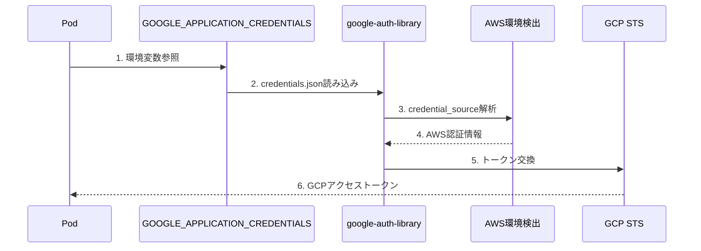
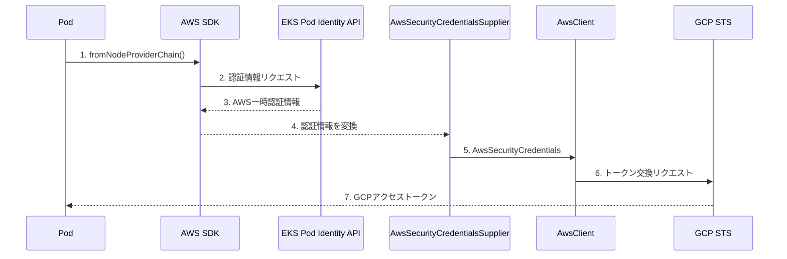

## はじめに

AWS EKS上で動作するNode.jsアプリケーションから、Google Cloud の Vertex AI にアクセスしたい。しかも、サービスアカウントキー（JSONファイル）を使わずに。

本記事では、**LangChainの`ChatVertexAI`をEKS環境でキーレス認証させる実装**を解説します。

### 背景：Workload Identity Federationとは

GCPの**Workload Identity Federation**を使うと、AWS IAMロールの認証情報をGCPのアクセストークンに交換できます。これにより：

- サービスアカウントキーの管理が不要
- キー漏洩リスクの排除
- 認証情報の自動ローテーション

```
EKS Pod → AWS IAMロール → GCP Workload Identity Federation → Vertex AI
```

インフラ側（Terraform/Kubernetes）の設定は[前回記事](https://zenn.dev/rtoya/articles/eks-gcp-workload-identity-federation)で解説しています。本記事はアプリケーション実装にフォーカスします。

### どの方式を選ぶべきか

GCP認証には2つのアプローチがあります：

| 方式 | 概要 | 推奨ケース |
|-----|------|-----------|
| **ConfigMap方式**（前回記事） | `GOOGLE_APPLICATION_CREDENTIALS`でcredentials.jsonを参照 | `@google-cloud/*`系ライブラリ、シンプルな構成 |
| **カスタムAwsClient方式**（本記事） | AWS SDKで認証情報を取得し、`google-auth-library`に注入 | LangChain、EKS Pod Identity環境 |

**本記事の方式が必要なケース：**
- `@langchain/google-vertexai`を使用している
- EKS Pod Identity環境で`ETIMEDOUT 169.254.169.254`エラーが発生する
- 認証情報の取得をAWS SDKに統一したい

### この記事で解説すること

- `google-auth-library`の`AwsSecurityCredentialsSupplier`を使ったカスタム認証
- AWS SDKの`fromNodeProviderChain`によるEKS認証連携
- LangChainの`ChatVertexAI`での認証設定
- IRSA/Pod Identity両対応の実装パターン

### 前提条件

- GCP Workload Identity Federationが設定済み（[前回記事](https://zenn.dev/rtoya/articles/eks-gcp-workload-identity-federation)参照）
- EKS Pod IdentityまたはIRSAが設定済み
- Node.js 18以上、TypeScript 5.x

---

## クイックスタート

すぐに実装したい方向けの手順です。詳細な解説は後続のセクションを参照してください。

### 1. パッケージインストール

```bash
npm install @aws-sdk/credential-providers google-auth-library @langchain/google-vertexai
```

### 2. 環境変数設定（Kubernetes ConfigMap）

```yaml
GCP_WORKLOAD_IDENTITY_AUDIENCE: "//iam.googleapis.com/projects/<PROJECT_NUMBER>/locations/global/workloadIdentityPools/<POOL_ID>/providers/<PROVIDER_ID>"
GCP_SERVICE_ACCOUNT_EMAIL: "<APP_NAME>@<GCP_PROJECT>.iam.gserviceaccount.com"
GOOGLE_CLOUD_PROJECT: "<GCP_PROJECT>"
```

### 3. 認証プロバイダ実装

```typescript
// src/auth/gcp-auth.ts
import { fromNodeProviderChain } from "@aws-sdk/credential-providers";
import { AwsClient, type AwsSecurityCredentialsSupplier } from "google-auth-library";

class EksAwsCredentialsSupplier implements AwsSecurityCredentialsSupplier {
  private provider = fromNodeProviderChain();

  async getAwsSecurityCredentials() {
    const creds = await this.provider();
    return {
      accessKeyId: creds.accessKeyId,
      secretAccessKey: creds.secretAccessKey,
      token: creds.sessionToken,
    };
  }

  getAwsRegion() {
    return Promise.resolve(process.env.AWS_REGION || "ap-northeast-1");
  }
}

export function createGcpAuthClient(): AwsClient | null {
  const audience = process.env.GCP_WORKLOAD_IDENTITY_AUDIENCE;
  const email = process.env.GCP_SERVICE_ACCOUNT_EMAIL;
  if (!audience || !email) return null;

  return new AwsClient({
    audience,
    subjectTokenType: "urn:ietf:params:aws:token-type:aws4_request",
    awsSecurityCredentialsSupplier: new EksAwsCredentialsSupplier(),
    serviceAccountImpersonationUrl: `https://iamcredentials.googleapis.com/v1/projects/-/serviceAccounts/${email}:generateAccessToken`,
  });
}
```

### 4. LangChainで使用

```typescript
import { ChatVertexAI } from "@langchain/google-vertexai";
import { createGcpAuthClient } from "./auth/gcp-auth";

const authClient = createGcpAuthClient();

const model = new ChatVertexAI({
  model: "gemini-1.5-pro",
  authOptions: authClient ? { authClient } : undefined,
});
```

---

## 課題：`GOOGLE_APPLICATION_CREDENTIALS`だけでは不十分

前回記事で作成したConfigMapのcredentials設定：

```json
{
  "type": "external_account",
  "audience": "//iam.googleapis.com/projects/.../workloadIdentityPools/.../providers/...",
  "credential_source": {
    "environment_id": "aws1",
    "regional_cred_verification_url": "https://sts.{region}.amazonaws.com..."
  },
  ...
}
```

この設定でGCPクライアントライブラリは動作しますが、**一部のライブラリでは問題が発生**します。

### 問題が発生するケース

**再現条件：**
- `@langchain/google-vertexai` 2.x 系を使用
- EKS Pod Identity環境（IRSAではなく）
- `GOOGLE_APPLICATION_CREDENTIALS`でcredentials.jsonを参照

`@langchain/google-vertexai`は内部で`google-auth-library`を使用しています。`credential_source`に`environment_id: "aws1"`を指定すると、ライブラリはIMDS（EC2メタデータサービス `169.254.169.254`）経由でAWS認証情報を取得しようとします。

しかし、**EKS Pod Identity環境ではIMDSではなく専用エンドポイント**（`AWS_CONTAINER_CREDENTIALS_FULL_URI`）を使う必要があります。この不整合がエラーの原因です。

:::message
**IRSAの場合は問題が発生しにくい**: IRSAはWebアイデンティティトークンファイル経由で認証するため、IMDSへのアクセスは発生しません。本記事の実装はIRSA/Pod Identity両方で動作しますが、特にPod Identity環境で有効です。
:::

### 実際に発生するエラー例

**エラー1: 認証タイプ検出失敗**
```
Error: Unable to detect a credential type from the provided configuration.
Please ensure the credential_source is properly configured.
```

**エラー2: IMDSタイムアウト**
```
Error: connect ETIMEDOUT 169.254.169.254:80
    at TCPConnectWrap.afterConnect [as oncomplete]
```

**原因**: `google-auth-library`がIMDSにアクセスしようとするが、EKS Pod Identity環境ではIMDSv2がPodからアクセスできない、または`AWS_CONTAINER_CREDENTIALS_FULL_URI`を使うべき環境でIMDSにフォールバックしている。

## 解決策：カスタム`AwsSecurityCredentialsSupplier`

`google-auth-library`の`AwsClient`には、カスタムの認証情報プロバイダを注入できる`AwsSecurityCredentialsSupplier`インターフェースがあります。これを使って、AWS SDKの認証プロバイダチェーンと連携させます。

### 実装コード

```typescript:src/infrastructure/auth/AwsCredentialRefresher.ts
/**
 * Custom AWS Security Credentials Supplier for GCP Workload Identity Federation
 *
 * AWS SDKのcredential provider chainを使用してAWS認証情報を取得し、
 * GCP Workload Identity Federationに渡すカスタムプロバイダ
 *
 * 対応する認証方式:
 * - IRSA (IAM Roles for Service Accounts)
 * - EKS Pod Identity
 */

import { fromNodeProviderChain } from "@aws-sdk/credential-providers";
import {
  AwsClient,
  type AwsSecurityCredentials,
  type AwsSecurityCredentialsSupplier,
} from "google-auth-library";

/**
 * EKS環境用のAWS認証情報プロバイダ
 * AWS SDKのcredential provider chainを使用するため、
 * IRSA/Pod Identityどちらでも動作する
 */
class EksAwsSecurityCredentialsSupplier
  implements AwsSecurityCredentialsSupplier
{
  private readonly credentialProvider = fromNodeProviderChain();

  async getAwsSecurityCredentials(): Promise<AwsSecurityCredentials> {
    const credentials = await this.credentialProvider();

    console.log(
      `AWS credentials fetched. Expires: ${credentials.expiration?.toISOString() ?? "unknown"}`,
    );

    return {
      accessKeyId: credentials.accessKeyId,
      secretAccessKey: credentials.secretAccessKey,
      token: credentials.sessionToken,
    };
  }

  getAwsRegion(): Promise<string> {
    return Promise.resolve(process.env.AWS_REGION || "ap-northeast-1");
  }
}
```

:::message
本番環境では`console.log`を適切なロガー（winston、pino等）に置き換えてください。また、認証情報のログ出力はセキュリティリスクがあるため、デバッグ時のみ有効にすることを推奨します。
:::

### ポイント解説

#### 1. `fromNodeProviderChain`の活用

```typescript
import { fromNodeProviderChain } from "@aws-sdk/credential-providers";

private readonly credentialProvider = fromNodeProviderChain();
```

`fromNodeProviderChain`はAWS SDKが提供するcredential providerで、以下の順序で認証情報を自動検出します：

1. 環境変数（`AWS_ACCESS_KEY_ID`等）
2. SSO認証
3. Webアイデンティティトークン（**IRSA**）
4. コンテナ認証情報（**EKS Pod Identity**）
5. IMDSv2（EC2インスタンス）

これにより、**IRSA/Pod Identityどちらでも同じコードで動作**します。

#### 2. `AwsSecurityCredentials`への変換

```typescript
return {
  accessKeyId: credentials.accessKeyId,
  secretAccessKey: credentials.secretAccessKey,
  token: credentials.sessionToken,  // 一時認証情報のセッショントークン
};
```

AWS SDKの認証情報を`google-auth-library`が期待する形式に変換しています。`token`フィールドがないとGCP WIFが正しく動作しないので注意。

## 環境検出ユーティリティ

EKS環境かどうかを検出するユーティリティ関数を実装します：

```typescript
/**
 * IRSA環境かどうか判定
 * IRSA使用時は AWS_WEB_IDENTITY_TOKEN_FILE と AWS_ROLE_ARN が設定される
 */
export function isIrsaEnvironment(): boolean {
  return !!(
    process.env.AWS_WEB_IDENTITY_TOKEN_FILE &&
    process.env.AWS_ROLE_ARN
  );
}

/**
 * EKS Pod Identity環境かどうか判定
 * Pod Identity使用時は以下が設定される
 */
export function isPodIdentityEnvironment(): boolean {
  return !!(
    process.env.AWS_CONTAINER_CREDENTIALS_FULL_URI &&
    process.env.AWS_CONTAINER_AUTHORIZATION_TOKEN_FILE
  );
}

/**
 * EKS環境（IRSA または Pod Identity）かどうか判定
 */
export function isEksEnvironment(): boolean {
  return isIrsaEnvironment() || isPodIdentityEnvironment();
}
```

### 環境変数の違い

| 認証方式 | 環境変数 |
|---------|---------|
| IRSA | `AWS_WEB_IDENTITY_TOKEN_FILE`, `AWS_ROLE_ARN` |
| Pod Identity | `AWS_CONTAINER_CREDENTIALS_FULL_URI`, `AWS_CONTAINER_AUTHORIZATION_TOKEN_FILE` |

これらはEKSが自動的にPodに注入するため、アプリ側での設定は不要です。

## AwsClientファクトリ

環境に応じて適切な`AwsClient`を生成するファクトリ関数：

```typescript
/**
 * EKS環境用のAwsClientを生成
 * EKS以外の環境ではnullを返す（ADCにフォールバック）
 */
export function createAwsClientForEks(): AwsClient | null {
  if (!isEksEnvironment()) {
    console.log("EKS環境ではありません。デフォルト認証を使用します。");
    return null;
  }

  const authMethod = isPodIdentityEnvironment() ? "Pod Identity" : "IRSA";
  console.log(`EKS ${authMethod} 環境を検出しました。`);

  // GCP WIF設定（環境変数から取得）
  const audience = process.env.GCP_WORKLOAD_IDENTITY_AUDIENCE;
  const serviceAccountEmail = process.env.GCP_SERVICE_ACCOUNT_EMAIL;

  if (!audience || !serviceAccountEmail) {
    console.warn(
      "GCP_WORKLOAD_IDENTITY_AUDIENCE または GCP_SERVICE_ACCOUNT_EMAIL が未設定です。"
    );
    return null;
  }

  return new AwsClient({
    audience,
    subjectTokenType: "urn:ietf:params:aws:token-type:aws4_request",
    awsSecurityCredentialsSupplier: new EksAwsSecurityCredentialsSupplier(),
    serviceAccountImpersonationUrl:
      `https://iamcredentials.googleapis.com/v1/projects/-/serviceAccounts/${serviceAccountEmail}:generateAccessToken`,
  });
}
```

### 必要な環境変数

```yaml
# Kubernetes ConfigMap
GCP_WORKLOAD_IDENTITY_AUDIENCE: "//iam.googleapis.com/projects/<PROJECT_NUMBER>/locations/global/workloadIdentityPools/<POOL_ID>/providers/<PROVIDER_ID>"
GCP_SERVICE_ACCOUNT_EMAIL: "<APP_NAME>@<GCP_PROJECT>.iam.gserviceaccount.com"
```

## LangChainとの統合

`ChatVertexAI`でカスタム認証を使用する実装：

```typescript:src/infrastructure/model/ModelFactory.ts
import type { BaseChatModel } from "@langchain/core/language_models/chat_models";
import { ChatVertexAI } from "@langchain/google-vertexai";
import { createAwsClientForEks } from "../auth/AwsCredentialRefresher";

// モデル設定の型定義
interface ModelConfig {
  modelName: string;
  temperature?: number;
  maxTokens?: number;
}

// シングルトンでAwsClientをキャッシュ
let cachedAwsClient: ReturnType<typeof createAwsClientForEks> | undefined;

function getAwsClient() {
  if (cachedAwsClient === undefined) {
    cachedAwsClient = createAwsClientForEks();
  }
  return cachedAwsClient;
}

export function createChatModel(config: ModelConfig): BaseChatModel {
  const awsClient = getAwsClient();

  // EKS環境: カスタム認証を使用
  if (awsClient) {
    return new ChatVertexAI({
      model: config.modelName,
      temperature: config.temperature,
      maxOutputTokens: config.maxTokens,
      authOptions: {
        authClient: awsClient,  // カスタムAwsClientを注入
      },
    });
  }

  // ローカル環境: ADCを使用
  return new ChatVertexAI({
    model: config.modelName,
    temperature: config.temperature,
    maxOutputTokens: config.maxTokens,
  });
}
```

### ポイント

1. **シングルトンパターン**: `AwsClient`は一度生成したらキャッシュ
2. **フォールバック**: EKS以外ではADC（Application Default Credentials）を使用
3. **`authOptions.authClient`**: LangChainの`ChatVertexAI`は`authClient`プロパティでカスタム認証クライアントを受け入れる

## パッケージ依存関係

```json:package.json
{
  "dependencies": {
    "@aws-sdk/credential-providers": "^3.817.0",
    "@langchain/core": "^0.3.0",
    "@langchain/google-vertexai": "^2.1.3",
    "google-auth-library": "^10.5.0"
  }
}
```

:::message
`google-auth-library`と`@langchain/core`は`@langchain/google-vertexai`の依存関係として含まれますが、型定義（`AwsSecurityCredentialsSupplier`、`BaseChatModel`）を直接使用するため明示的に追加しています。
:::

## Kubernetes設定

前回記事の設定に加え、以下の環境変数を追加します：

```yaml:configmap.yaml
apiVersion: v1
kind: ConfigMap
metadata:
  name: app-env
data:
  # 既存の設定...

  # AWS設定
  AWS_REGION: "ap-northeast-1"

  # GCP WIF設定（追加）
  GCP_WORKLOAD_IDENTITY_AUDIENCE: "//iam.googleapis.com/projects/<PROJECT_NUMBER>/locations/global/workloadIdentityPools/aws-eks-pool-<ENV>/providers/aws-eks-provider"
  GCP_SERVICE_ACCOUNT_EMAIL: "<APP_NAME>@<GCP_PROJECT>.iam.gserviceaccount.com"
  GOOGLE_CLOUD_PROJECT: "<GCP_PROJECT>"

  # Vertex AI設定
  GOOGLE_VERTEX_LOCATION: "asia-northeast1"
```

:::message alert
`GOOGLE_APPLICATION_CREDENTIALS`は**不要**です。カスタム`AwsClient`を使う場合、credentialsファイルは必要ありません。
:::

## 認証フローの違い

### ConfigMapベースの認証（前回記事）



### カスタムAwsClientベース（本記事）



**違い**: AWS認証情報の取得をAWS SDKに委譲することで、より確実にEKS認証情報を取得できます。

## ローカル開発環境での動作

ローカル環境ではEKS環境変数が設定されていないため、自動的にADCにフォールバックします：

```bash
# ローカル環境でのセットアップ
gcloud auth application-default login
```

これにより、同じコードがローカルとEKS両方で動作します：

- **ローカル**: `isEksEnvironment()` → `false` → ADC使用
- **EKS**: `isEksEnvironment()` → `true` → カスタム`AwsClient`使用

## トラブルシューティング

### 認証エラー時のデバッグ

```typescript
// 現在の認証方式を確認
console.log("IRSA:", isIrsaEnvironment());
console.log("Pod Identity:", isPodIdentityEnvironment());
console.log("EKS:", isEksEnvironment());

// AWS認証情報が取得できるか確認
const provider = fromNodeProviderChain();
const creds = await provider();
console.log("AccessKeyId:", creds.accessKeyId?.substring(0, 8) + "...");
console.log("Expiration:", creds.expiration);
```

### よくあるエラー

| エラー | 原因 | 対処 |
|-------|------|------|
| `Unable to detect a credential type` | EKS環境変数が未設定 | Pod Identity Associationを確認 |
| `Invalid audience` | audienceの不一致 | GCP WIF Pool/Providerの設定を確認 |
| `Permission denied` | IAMバインディング不足 | GCP SA権限とWIFバインディングを確認 |

## まとめ

本記事では、Node.js/TypeScriptアプリケーションでGCP Workload Identity Federationを実装する方法を解説しました。

### ポイント

1. **AWS SDKの活用**: `fromNodeProviderChain`でIRSA/Pod Identity両対応
2. **カスタムSupplier**: `AwsSecurityCredentialsSupplier`で認証情報を橋渡し
3. **環境自動検出**: 同じコードでローカル/EKS両対応
4. **LangChain統合**: `authOptions.authClient`でカスタム認証を注入

前回記事のインフラ設定と組み合わせることで、キーレスかつセキュアなGCPアクセスが実現できます。

## 関連記事

- [AWS EKS から GCP にキーレスでアクセス（Workload Identity Federation）](https://zenn.dev/rtoya/articles/eks-gcp-workload-identity-federation)

## 参考リンク

- [google-auth-library - AwsClient](https://github.com/googleapis/google-auth-library-nodejs)
- [AWS SDK Credential Providers](https://docs.aws.amazon.com/sdk-for-javascript/v3/developer-guide/setting-credentials-node.html)
- [LangChain - ChatVertexAI](https://js.langchain.com/docs/integrations/chat/google_vertex_ai/)
