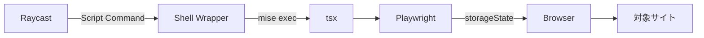
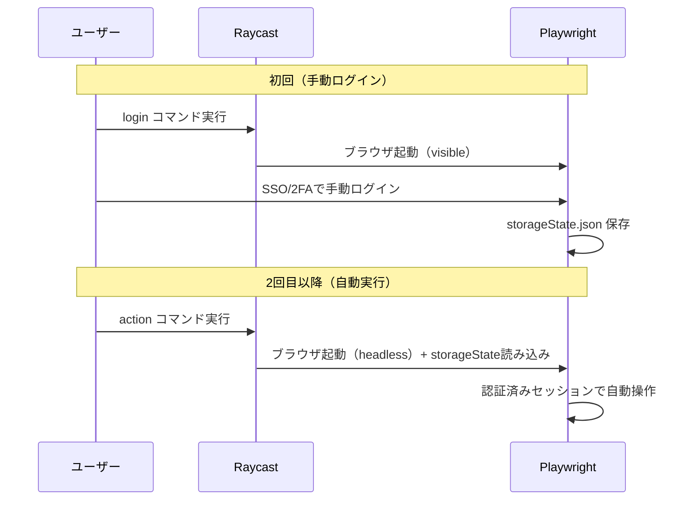

## はじめに

「Azure Cost Explorerを開いてスクショを撮る」「管理画面で毎朝同じ操作をする」——こういった繰り返しのWeb操作、手でやるの面倒じゃないですか？

本記事では、**Raycast Script Commands** と **Playwright** を組み合わせて、macOSのランチャーからワンキーでWeb操作を自動化する仕組みを紹介します。

SSO/2FAがあるサイトでも動作し、GitHub経由で社内配布できる構成です。

## アーキテクチャ概要



ポイントは以下の3つです。

1. **Raycast Script Commands** がエントリポイント（`.sh`ファイル）
2. **mise** でNode.js / pnpmのバージョンを固定
3. **Playwright storageState** でSSO/2FAセッションを再利用

## ディレクトリ構成

```
raycast-script-commands/
├── commands/                # Raycast Script Commands（.sh）
│   ├── sample-login.sh
│   ├── sample-action.sh
│   └── azure-cost-explorer.sh
├── scripts/                 # TypeScript自動化ロジック
│   ├── login.ts
│   ├── action.ts
│   ├── azure-cost-explorer.ts
│   └── lib/
│       ├── playwright.ts    # ブラウザ起動・セッション復元
│       ├── guard.ts         # URLホスト検証
│       ├── storageState.ts  # セッションファイル管理
│       └── logger.ts        # コンソール出力
├── mise.toml
├── package.json
├── install.sh
└── README.md
```

`commands/` にRaycastから呼ばれるShellスクリプト、`scripts/` に実際の自動化ロジックを置く二層構成です。

## セットアップ

### ランタイム管理（mise）

チーム全員が同じNode.jsとpnpmバージョンを使うため、[mise](https://mise.jdx.dev/) でバージョンを固定しています。

```toml:mise.toml
[tools]
node = "20"
pnpm = "9"
```

### パッケージ管理（pnpm強制）

`package.json` で `packageManager` を明示し、`.npmrc` で `engine-strict=true` を設定することで、npm/yarnの誤使用を防いでいます。

```json:package.json
{
  "name": "raycast-web-automation",
  "packageManager": "pnpm@9",
  "dependencies": {
    "playwright": "^1.50.0"
  },
  "devDependencies": {
    "tsx": "^4.19.0",
    "typescript": "^5.7.0"
  }
}
```

### インストール

`install.sh` を実行するだけで環境構築が完了します。

```bash
./install.sh
```

内部では以下が実行されます。

```bash
mise install                        # Node.js 20 + pnpm 9をインストール
pnpm install --frozen-lockfile      # 依存パッケージをインストール
pnpm exec playwright install        # Playwrightブラウザをダウンロード
```

## 認証の仕組み（SSO/2FA対応）

最大のポイントは**認証情報をリポジトリに含めない**ことです。

### 認証フロー



初回だけ手動でログインし、セッション情報を `storageState.json` としてローカルに保存します。2回目以降はこのセッションを再利用して、headlessブラウザで自動操作を行います。

### storageState の保存先

```
~/.config/raycast-web-automation/<site>/storageState.json
```

サイトごとにディレクトリを分離し、クロスサイトのセッション漏洩を防いでいます。

```typescript:scripts/lib/storageState.ts
import path from "path";
import os from "os";
import fs from "fs";

const BASE_DIR = path.join(
  os.homedir(),
  ".config",
  "raycast-web-automation"
);

export function getStorageStatePath(site: string): string {
  return path.join(BASE_DIR, site, "storageState.json");
}

export function storageStateExists(site: string): boolean {
  return fs.existsSync(getStorageStatePath(site));
}
```

:::message
`storageState.json` には認証トークンが含まれます。絶対にGitにコミットしたり、他人と共有しないでください。
:::

## セキュリティ：ホスト検証

自動化スクリプトが想定外のURLにアクセスしないよう、ホワイトリスト方式でアクセス先を制限しています。

```typescript:scripts/lib/guard.ts
export function assertAllowedHost(
  url: string,
  allowedHosts: string[]
): void {
  const parsed = new URL(url);
  if (!allowedHosts.includes(parsed.hostname)) {
    console.error(
      `Access denied: ${parsed.hostname} is not in allowed hosts`
    );
    process.exit(1);
  }
}
```

各スクリプトの冒頭で呼び出します。

```typescript
assertAllowedHost(targetUrl, [
  "portal.azure.com",
  "login.microsoftonline.com",
]);
```

## Raycast Script Commands の書き方

`commands/` に置く `.sh` ファイルには、Raycastメタデータを埋め込みます。

```bash:commands/azure-cost-explorer.sh
#!/bin/bash

# @raycast.schemaVersion 1
# @raycast.title Azure Cost Explorer
# @raycast.mode compact
# @raycast.packageName Web Automation

cd "$(dirname "$0")/.." || exit 1
mise exec -- pnpm exec tsx scripts/azure-cost-explorer.ts
```

重要なのは実行方法です。

```bash
mise exec -- pnpm exec tsx scripts/<script>.ts
```

`mise exec` でNode.js/pnpmのバージョンを保証し、`pnpm exec tsx` でTypeScriptを直接実行します。nodeを直接叩くことはしません。

## 実装例：Azure Cost Explorerスクリーンショット

実際の自動化スクリプトの例を見てみましょう。

```typescript:scripts/azure-cost-explorer.ts
const SITE = "azure";
const ALLOWED_HOSTS = [
  "portal.azure.com",
  "login.microsoftonline.com",
];
const COST_EXPLORER_URL = "https://portal.azure.com/#view/...";

async function main() {
  // セッションが無ければ手動ログインフロー
  if (!storageStateExists(SITE)) {
    const { browser, context } = await launchBrowser({ headless: false });
    const page = await context.newPage();
    await page.goto("https://portal.azure.com");

    // ユーザーが手動でログインするのを待つ
    // 3秒ごとにセッションを保存（ポーリング）
    const interval = setInterval(async () => {
      await context.storageState({
        path: getStorageStatePath(SITE),
      });
    }, 3000);

    await page.waitForURL("**/portal.azure.com/**");
    clearInterval(interval);
    await browser.close();
  }

  // 保存済みセッションで自動操作
  const { browser, context } = await launchBrowser({
    headless: true,
    storageStatePath: getStorageStatePath(SITE),
  });

  const page = await context.newPage();
  assertAllowedHost(COST_EXPLORER_URL, ALLOWED_HOSTS);
  await page.goto(COST_EXPLORER_URL, { waitUntil: "networkidle" });

  // チャートの描画を待つ
  await page.waitForTimeout(5000);

  // スクリーンショット保存
  const timestamp = new Date().toISOString().replace(/[:.]/g, "-");
  const filePath = path.join(
    os.homedir(),
    "Desktop",
    `azure-cost-explorer-${timestamp}.png`
  );
  await page.screenshot({ path: filePath, fullPage: true });
  await browser.close();

  console.log(`Screenshot saved: ${filePath}`);
}
```

このスクリプトは以下のことをやっています。

1. セッションが無ければブラウザを開いて手動ログインを促す
2. ログイン完了後、セッションをローカルに保存
3. 保存済みセッションでheadlessブラウザを起動
4. Cost Explorerに遷移してスクリーンショットを撮影
5. デスクトップにPNGとして保存

## 新しいサイトの追加方法

新しいWeb操作を追加するのは簡単です。

### 1. TypeScriptスクリプトを作成

```typescript:scripts/new-site-action.ts
import { launchBrowser } from "./lib/playwright";
import { getStorageStatePath, storageStateExists } from "./lib/storageState";
import { assertAllowedHost } from "./lib/guard";

const SITE = "new-site";
const ALLOWED_HOSTS = ["app.new-site.com"];

async function main() {
  if (!storageStateExists(SITE)) {
    console.error('Authentication not found. Run "new-site-login" first.');
    process.exit(1);
  }

  const { browser, context } = await launchBrowser({
    headless: true,
    storageStatePath: getStorageStatePath(SITE),
  });

  const page = await context.newPage();
  assertAllowedHost("https://app.new-site.com/dashboard", ALLOWED_HOSTS);
  await page.goto("https://app.new-site.com/dashboard");

  // ここに自動操作を書く

  await browser.close();
}

main();
```

### 2. Raycast Script Command を作成

```bash:commands/new-site-action.sh
#!/bin/bash

# @raycast.schemaVersion 1
# @raycast.title New Site Action
# @raycast.mode compact
# @raycast.packageName Web Automation

cd "$(dirname "$0")/.." || exit 1
mise exec -- pnpm exec tsx scripts/new-site-action.ts
```

### 3. PRを出す

チームメンバーがレビューして `main` にマージすれば、全員が `git pull` で新しいコマンドを使えます。

## 運用上のポイント

### セッション切れへの対応

storageStateはCookieベースなので、一定期間でセッションが切れます。その場合はloginコマンドを再実行するだけです。

### セレクタ変更への対応

対象サイトのUIが変わるとPlaywrightのセレクタが壊れます。修正してPRを出すフローにしておけば、チーム全体にすぐ反映できます。

### Raycastへの登録

Raycast Settings → Extensions → Script Commands → Add Script Directory で `commands/` ディレクトリを指定します。以降、Raycastのランチャーからコマンド名で検索して実行できます。

## まとめ

| 要素 | 採用技術 |
|------|---------|
| ランチャー | Raycast Script Commands |
| ブラウザ自動化 | Playwright |
| 言語 | TypeScript（tsx実行） |
| ランタイム管理 | mise |
| パッケージ管理 | pnpm |
| 認証 | storageState（ローカル保存） |
| 配布 | GitHub（PR経由） |

Raycast + Playwrightの組み合わせにより、以下を実現しました。

- **ワンキーでWeb操作を自動化**（Raycastから即実行）
- **SSO/2FA対応**（初回手動ログイン、以降は自動）
- **社内配布が容易**（git pull + install.sh で完結）
- **セキュリティ確保**（認証情報はローカルのみ、ホスト検証あり）

定型的なWeb操作を自動化したい場面があれば、ぜひ試してみてください。
